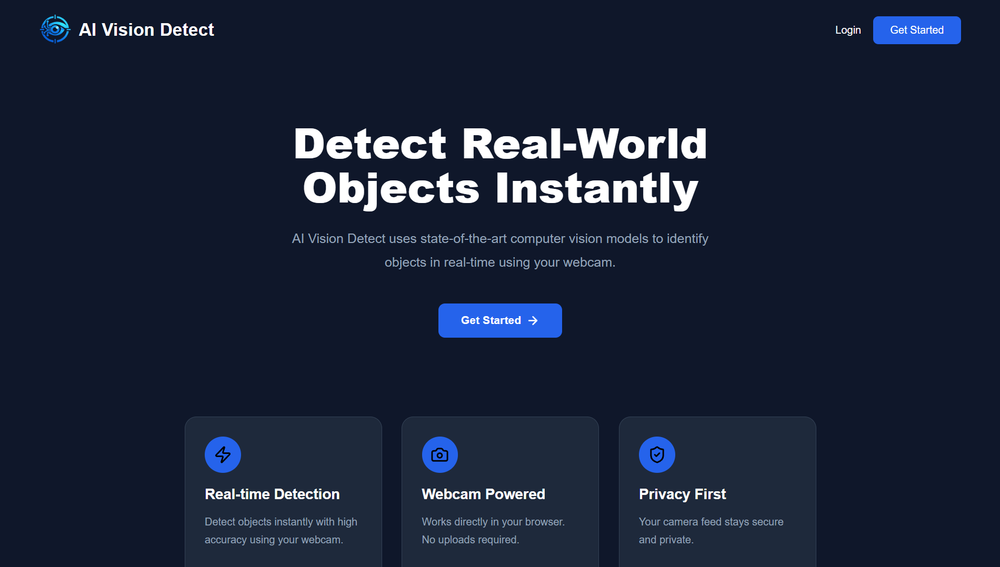
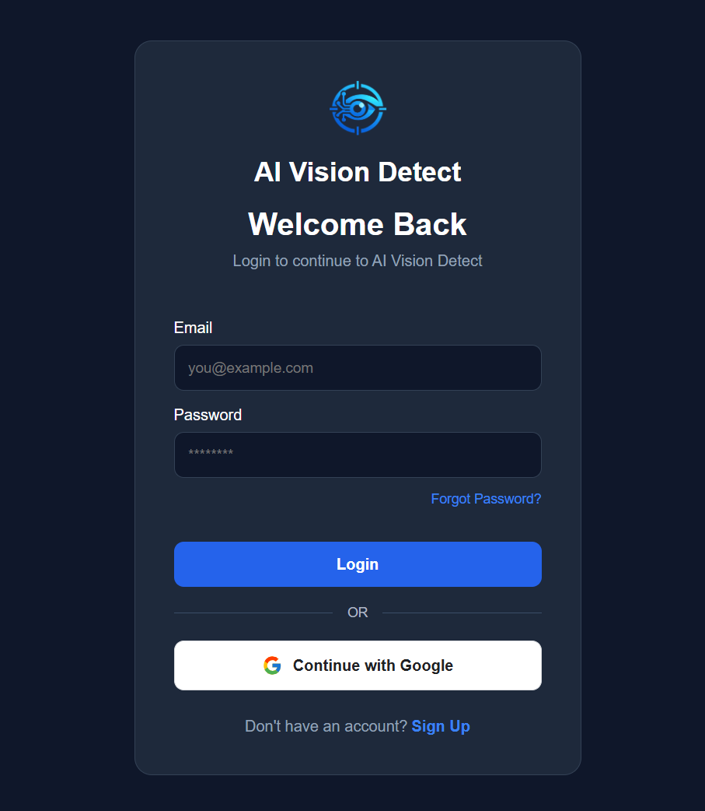
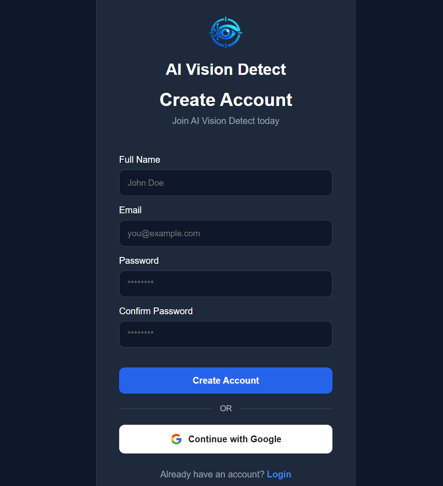
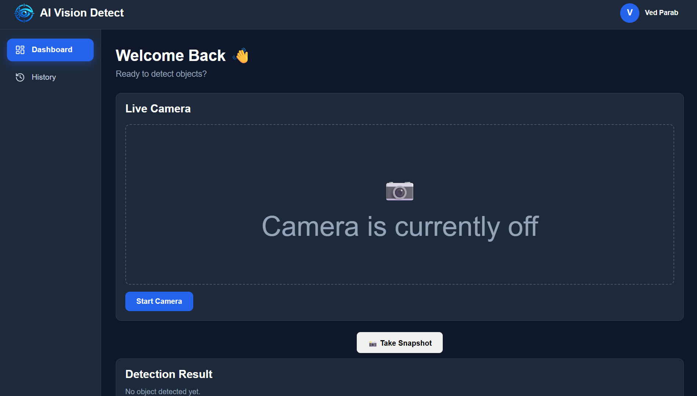
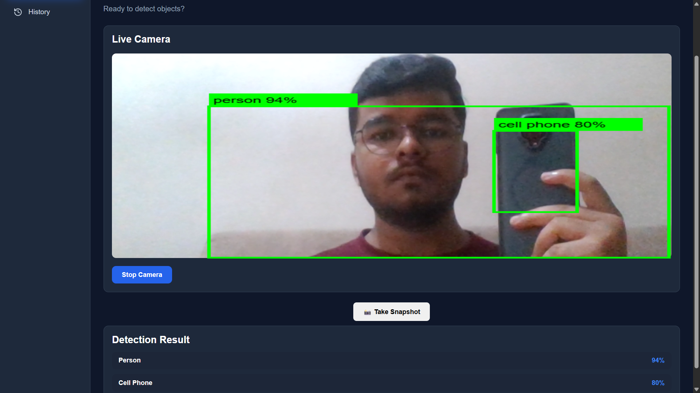
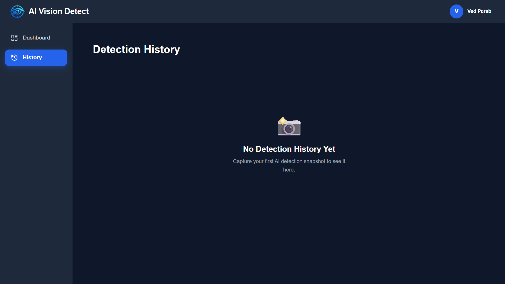
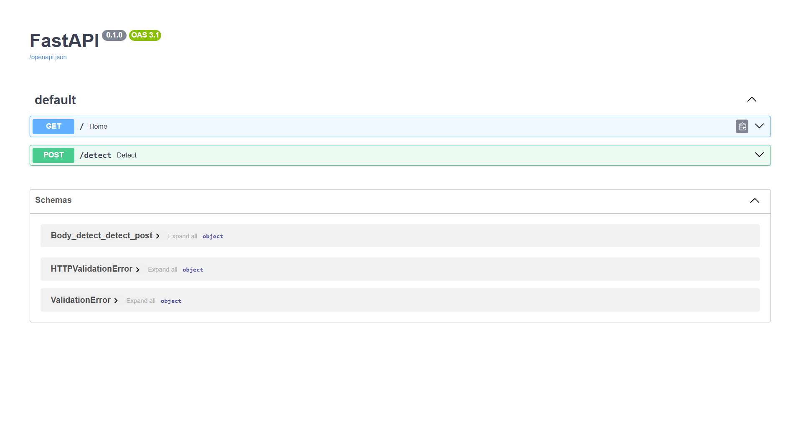

# 👁️ AI Vision Detect

> A full-stack AI-powered real-time object detection web application built using **React, FastAPI, YOLOv8, Firebase Authentication, Railway, and Vercel**.


---

# 🚀 Live Demo

### 🌐 Frontend

🔗 **Frontend:** <https://ai-vision-detect.vercel.app/>

### ⚙️ Backend API

🔗 **Backend API:** <https://ai-vision-detect-production.up.railway.app/>

### 📄 API Documentation

🔗 **Swagger UI:** <https://ai-vision-detect-production.up.railway.app/docs>

---

# 📖 Project Overview

AI Vision Detect is a full-stack computer vision web application that performs real-time object detection using a webcam.

The application allows users to authenticate securely, access a live detection dashboard, detect multiple objects in real time using YOLOv8, and view previously detected objects through a dedicated history page.

The backend is developed using FastAPI and deployed on Railway, while the frontend is built using React and deployed on Vercel.

---

# ✨ Features

- 🔐 Firebase Authentication
- 👤 User Login & Signup
- 📹 Live Webcam Streaming
- 🤖 Real-Time Object Detection
- 📦 Multiple Object Detection
- 📊 Detection History
- ⚡ FastAPI REST API
- 🌐 Railway Backend Deployment
- 🚀 Vercel Frontend Deployment
- 📱 Responsive User Interface

---

# 🛠 Tech Stack

## Frontend

- React
- Vite
- JavaScript
- CSS
- Firebase Authentication

---

## Backend

- Python
- FastAPI
- Uvicorn
- OpenCV
- NumPy

---

## AI / Computer Vision

- YOLOv8n
- Ultralytics

---

## Deployment

- Vercel
- Railway

---

## Version Control

- Git
- GitHub

---

# 📂 Project Structure

```text
AI-Vision-Detect
│
├── frontend
│   ├── src
│   ├── components
│   ├── pages
│   ├── services
│   └── firebase
│
├── backend
│   ├── api
│   ├── main.py
│   ├── requirements.txt
│   └── yolov8n.pt
│
└── README.md
```
# ⚙️ Installation

## 1. Clone the Repository

```bash
git clone https://github.com/vedparab/AI-Vision-Detect.git
cd AI-Vision-Detect
```

---

## 2. Frontend Setup

```bash
cd frontend
npm install
npm run dev
```

The frontend will start at:

```
http://localhost:5173
```

---

## 3. Backend Setup

```bash
cd backend
python -m venv venv312
venv312\Scripts\activate
pip install -r requirements.txt
python -m uvicorn main:app --reload
```

The backend will start at:

```
http://127.0.0.1:8000
```

Swagger Documentation:

```
http://127.0.0.1:8000/docs
```

---

# ▶️ Usage

1. Create a new account or log in using Firebase Authentication.
2. Navigate to the Dashboard.
3. Click **Start Camera**.
4. Allow browser camera permissions.
5. Point the camera towards supported objects.
6. View real-time detection results with bounding boxes and confidence scores.
7. Open the **History** page to review previously detected objects.

---

# 📡 API Endpoints

| Method | Endpoint | Description |
|--------|----------|-------------|
| GET    | `/`      | Home endpoint |
| POST   | `/detect`| Performs real-time object detection |

Interactive API documentation is available at:

```
/docs
```

---

# 🧠 Model Information

The application uses the **pretrained YOLOv8n** object detection model provided by **Ultralytics**.

### Model Details

- Model: YOLOv8n
- Framework: Ultralytics YOLO
- Dataset: Microsoft COCO Dataset
- Total Classes: 80
- Task: Real-Time Object Detection

The model is integrated into the FastAPI backend to perform inference on webcam frames received from the frontend.

**Note:** This project uses the pretrained YOLOv8n model and does not include custom training or fine-tuning.

---

# 📌 Project Status

AI Vision Detect Version 1.0 is the final stable release of this project. It has been completed as a full-stack portfolio application demonstrating real-time object detection using a pretrained YOLOv8n model, FastAPI, React, Firebase Authentication, Railway, and Vercel deployment.

# 📸 Screenshots

## 🏠 Landing Page



---

## 🔐 Login Page



---

## 📝 Signup Page



---

## 📊 Dashboard



---

## 🎥 Live Object Detection



---

## 📜 Detection History



---

## 📄 API Documentation (Swagger UI)




# 👨‍💻 Author

**Ved Rajesh Parab**

- GitHub: <https://github.com/vedparab>
- LinkedIn: <https://www.linkedin.com/in/ved-parab-33472b358>

---
